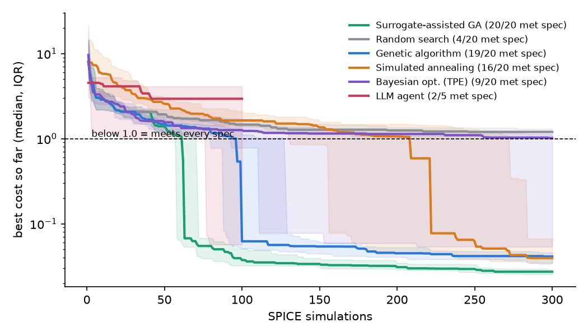
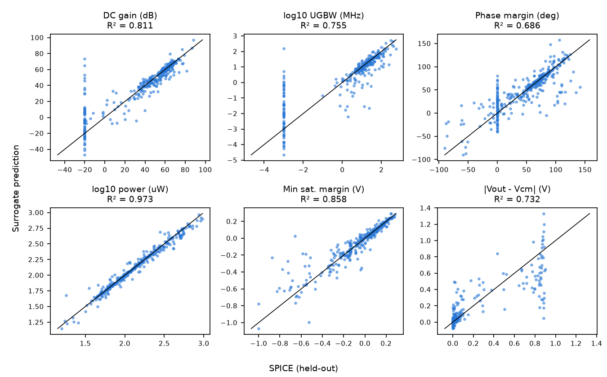

# SizeAgent

**This repo treats transistor sizing for a SKY130 two-stage op-amp as a combinatorial optimization problem, solved with search algorithms, a PyTorch surrogate model, and a tool-calling LLM agent. Every result is checked in ngspice.**

Live dashboard: **https://nags-gk.github.io/sizeagent/** (benchmark curves, agent traces, surrogate parity plots, an in-browser surrogate predictor, and PVT/Monte Carlo results)



## Why this is a combinatorial problem

SkyWater SKY130 MOSFET models are *binned*: only characterized per-finger (W, L) pairs are valid. Each device group picks one of those geometries plus an integer multiplier. C<sub>c</sub>, R<sub>z</sub> and I<sub>bias</sub> come from fixed grids. Put together, that is **~3.6 × 10¹⁵ discrete sizings**. A design has to meet all of these targets at once:

| Spec | Target |
|---|---|
| DC gain | ≥ 60 dB |
| Unity-gain bandwidth (C<sub>L</sub> = 2 pF) | ≥ 20 MHz |
| Phase margin | ≥ 60° |
| Power (VDD = 1.8 V) | ≤ 250 µW |
| Every transistor in saturation | margin ≥ 50 mV |
| Systematic offset \|V<sub>out</sub> − 0.9 V\| | ≤ 50 mV |

## What's here

| Component | What it does |
|---|---|
| `scripts/setup_pdk.sh`, `build_models.py` | Fetches only the SKY130 1.8 V core FET models (tt/ff/ss/fs/sf), then patches them for ngspice the same way open_pdks does: subckt parameters, the `mult` → `m` pass-through, and per-instance Monte Carlo mismatch |
| `sizeagent/spice.py` | ngspice testbench runner. The open-loop AC sweep uses a 1 GH DC-feedback inductor to set the bias point, then measures gain, UGBW, phase margin, power, offset and each device's operating point (gm, gds, V<sub>dsat</sub>, …) |
| `sizeagent/optimizers/search.py` | Random search, genetic algorithm, simulated annealing, and Bayesian optimization (Optuna TPE) over the discrete genome |
| `sizeagent/surrogate.py` | MLP ensemble (PyTorch) that predicts SPICE metrics, plus a **surrogate-assisted GA** that screens 400 offspring per generation and simulates only the 10 most promising |
| `sizeagent/agent/` | Tool-calling LLM agent with four tools: `simulate`, `refine` (seeded local search), `verify_pvt`, `submit`. It works with any OpenAI-compatible endpoint: Gemini (free tier), Groq, or local Ollama |
| `sizeagent/pvt.py` | 5 process corners × 3 temperatures, plus mismatch Monte Carlo |

## Results

Each strategy gets the same budget of **300 unique SPICE simulations**, run over **20 seeds**. Repeated designs are cached and not counted. Intervals are 95% (Wilson for success rate, bootstrap for the median). Regenerate with `python scripts/stats.py`.

| Strategy | Met spec (of 20) | Median sims to spec* | Median best power (feasible runs) | Lowest power |
|---|---|---|---|---|
| Surrogate-assisted GA | 20/20 (84-100%) | 62 (58-69) | 68.2 µW | 57.2 µW |
| Genetic algorithm | 19/20 (76-99%) | 98 (89-126) | 98.8 µW | 64.6 µW |
| Simulated annealing | 16/20 (58-92%) | 216 (158-268) | 94.3 µW | 69.9 µW |
| Bayesian opt. (TPE) | 9/20 (26-66%) | >300 | 118.1 µW | 59.9 µW |
| Random search | 4/20 (8-42%) | >300 | 155.1 µW | 120.8 µW |

\*Median over all seeds, counting a failed run as >300 (right-censored at budget + 1).

The surrogate-assisted GA met spec in every seed and needed about a third fewer simulations than the plain GA (Mann-Whitney p = 0.0002), and about 3.5x fewer than simulated annealing (p < 0.0001). Plain GA vs. TPE and random search are also significant (p = 0.008 and p < 0.0001). Random search vs. TPE and TPE vs. SA are not (p = 0.12, 0.55).

Surrogate vs. SPICE on held-out designs:



| Metric | Held-out R² | MAE |
|---|---|---|
| DC gain (dB) | 0.811 | 6.58 |
| log10 UGBW (MHz) | 0.755 | 0.402 |
| Phase margin (deg) | 0.686 | 15.2 |
| log10 power (uW) | 0.973 | 0.0314 |
| Min sat. margin (V) | 0.858 | 0.0427 |
| Vout offset from Vcm (V) | 0.732 | 0.0674 |

1600 training and 400 test designs. Accuracy is moderate: phase margin is hardest (R² 0.69). That is why the surrogate only *ranks* candidates and every reported number comes from SPICE.

**Robustness check.** The best design from each nominal-only run was re-simulated at 5 corners x 3 temperatures (15 total), plus 100 mismatch Monte Carlo runs (6-seed study; single best design per method):

| Best design from | Corners passing | Offset sigma (MC) |
|---|---|---|
| Genetic algorithm | 8/15 | 1.36 mV |
| Random search | 7/15 | 2.71 mV |
| Simulated annealing | 2/15 | 11.64 mV |
| Surrogate-assisted GA | 10/15 | 2.48 mV |
| Bayesian opt. (TPE) | 10/15 | 3.83 mV |

None of the nominal-only optima pass all 15 corners: optimizing at tt/27 C pushes designs to the edge of the spec.

### LLM agent (local, no API key)

`qwen2.5:7b` via Ollama, budget **100** simulations (not 300), 5 runs, every final design re-simulated in ngspice (`submitted_meets_spec`). Raw runs are in `results/`.

| Setup | Met spec | Sims to spec | Failure modes |
|---|---|---|---|
| Unguarded | 1/5 | 23 | 2 request timeouts, 1 run resubmitting one design 25 times, 1 out of turns |
| With guardrails (duplicate warning + auto-refine) | 2/5 | 2 and 77 | 2 request timeouts, 1 run spent all 100 sims without reaching spec |

Treat this as a small-sample, small-model data point: 5 runs cannot separate the two setups, and the auto-refine guardrail never triggered in the guarded batch. The dominant failure is slow CPU inference timing out (15+ minutes per run on a 16 GB laptop), not the sizing logic. The surrogate-assisted GA needs a median of 62 simulations with no failures, so for this problem the optimizer beats a 7B local agent; a stronger hosted model (a single earlier Gemini run met spec in 2 simulations) is the fair comparison still to be run at scale.

### Corner-aware optimization

`sizeagent/robust.py` adds a `RobustEvaluator`. A design is simulated at tt/27 C first; only nominally feasible designs are promoted to 6 extreme corners (ss and ff at -40/125 C, plus fs and sf at 27 C). A design counts as feasible only if it meets spec at all of them, and **every corner simulation is charged to the same budget**. Budget here is 600 simulations, 6 seeds, and the final design of every run is checked on the full 15-corner grid (`python scripts/robust_study.py`).

| Strategy | Robust-feasible runs | Median sims to robust spec | Full 15-corner grid passes (per seed) | Median power (feasible) |
|---|---|---|---|---|
| Surrogate-assisted GA | 6/6 | 113 | 15, 14, 14, 15, 14, 15 | 96 µW |
| Genetic algorithm | 4/6 | 305 | 14, 13, 14, 14, 15, 3 | 136 µW |
| Simulated annealing | 3/6 | 591 | 15, 5, 15, 15, 14, 7 | 185 µW |

Corner-aware search lifts the surrogate-assisted GA from 10/15 corners (nominal-only) to 14-15/15 on every seed, at roughly 2x the simulation count and about 1.4x the power of the nominal optimum. It is still not a guarantee: the optimizer sees 7 of the 15 grid points, and three of the six surrogate-GA designs fail one unseen grid point. Adding that point (or all 15) to the evaluator is the obvious next step.

### Honest caveats
- Only the transistors use foundry models. C<sub>c</sub>, R<sub>z</sub> and C<sub>L</sub> are ideal elements, and there are no layout parasitics.
- The default benchmark optimizes at tt, 27 °C; the corner-aware study above covers 7 of the 15 grid points and 6 seeds, not a formal worst-case guarantee.
- Phase margin and UGBW come from an open-loop AC analysis. There's no transient, slew-rate or noise analysis yet.
- The main benchmark uses 20 seeds per method; the robust and PVT studies use 6, so their conclusions are indicative, not statistically tight.

## Run it

```bash
sudo apt-get install ngspice              # or: brew install ngspice  (ngspice 42 and 47 tested)
./scripts/setup_pdk.sh                    # ~10 MB of SKY130 SPICE models
pip install -e .[dev] && pytest -q        # Python >= 3.10
# non-editable install? point at the built models: export SIZEAGENT_PDK=/path/to/pdk_models
# or skip local setup entirely:  docker build -t sizeagent . && docker run sizeagent

python scripts/run_benchmark.py --seeds 20 --budget 300
python scripts/surrogate_study.py && python scripts/pvt_study.py
python scripts/robust_study.py            # corner-aware optimization
python scripts/stats.py                   # CIs and significance tests
python scripts/make_report.py             # -> docs/data/results.json, docs/img/*.png

# LLM agent. Keys go in .env (copy .env.example; gitignored), never in chat or commits.
# `--provider auto` tries Groq, then Gemini, then local Ollama, whichever is configured and has quota left.
python -m sizeagent.agent --provider auto --budget 150 --out results/agent_run_1.json
# or Groq:   export GROQ_API_KEY=...   (free tier: ~200k tokens/day, 8k tokens/min)
# or fully local:  ollama pull qwen2.5:7b && python -m sizeagent.agent --provider ollama
```

## License

Apache-2.0. The SKY130 models are fetched at setup time from [google/skywater-pdk-libs-sky130_fd_pr](https://github.com/google/skywater-pdk-libs-sky130_fd_pr) (Apache-2.0) and are not redistributed here.
